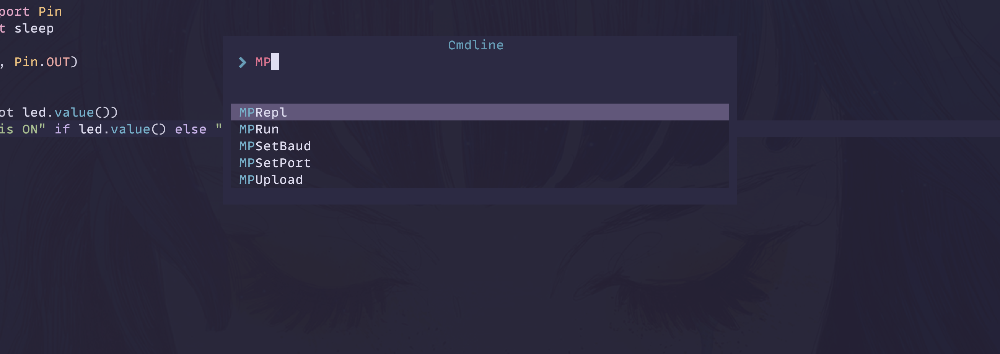
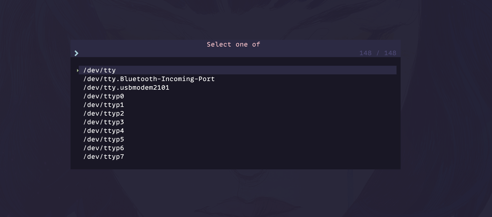
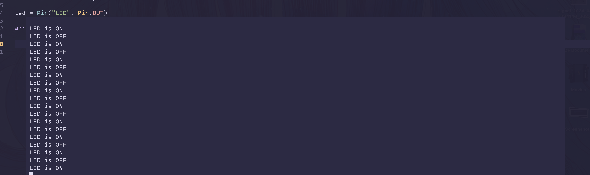
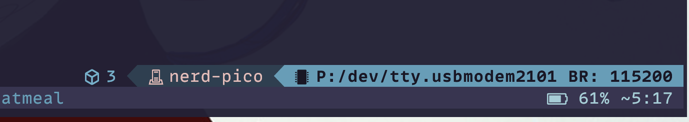

# micropython_nvim

<!-- panvimdoc-ignore-start -->



Theme: [duskfox](https://github.com/EdenEast/nightfox.nvim)

<details>
<summary>Showcase</summary>





</details>

<!-- panvimdoc-ignore-end -->

## Introduction

micropython_nvim is a plugin that aims to make it easier and more enjoyable to work on micropython projects in Neovim. See the [quickstart](#quickstart) section to get started.

## Goals

- Allows you to run and upload your python files directly to your chosen micro-controller straight from Neovim
- Allows general file management
- Allows easy management of port, baudrate, and other settings
- Allows easy set up of project environment
  - Create a new project, with project specific settings
- Easy access to the REPL

## Features

- **Run** local python files on your micro-controller
- **Upload** local python files to your micro-controller
- **REPL** access
- **File management**
- **Project initialisation**

## Requirements

- [Neovim >= 0.9](https://github.com/neovim/neovim/releases/tag/v0.9.0)
- [toggleterm.nvim](https://github.com/akinsho/toggleterm.nvim)
- [dressing.nvim](https://github.com/stevearc/dressing.nvim)(optional)
- [Adafruit ampy]()
- [rshell]()

## Quickstart

- [Install](#installation) micropython_nvim using your preferred package manager
- Add a keybind to `run` function
```lua
-- Lua
vim.keymap.set("n", "<leader>mr", require("micropython_nvim").run)
```

- Follow the [project setup](#project-setup) steps for a new project

**Next steps**

- Add a [statusline component](#statusline)

## Installation

<details>
<summary>lazy.nvim</summary>

```lua
{
    "jim-at-jibba/micropython.nvim",
    dependencies = { "akinsho/toggleterm.nvim", "stevearc/dressing.nvim" },
}
```

</details>

<details>
<summary>packer</summary>

```lua
use {
    "jim-at-jibba/micropython.nvim",
    requires = { "akinsho/toggleterm.nvim", "stevearc/dressing.nvim" },
}
```

</details>

## Usage

- `:MPRun` runs current buffer on the micro-controller
- `:MPSetPort` sets the port
- `:MPSetBaud` sets the baudrate
- `:MPRepl` opens the REPL
- `:MPInit` initalizes the project with basic settings and files. See [project setup](#project-setup)

## Project Setup

Steps to initialize a project

- Create a new directory for your project
- Optional but highly recommended create a virtual environment
- Run `:MPInit` in the project directory, this will create the necessary files and directories. This includes:
  - `main.py`
```python
from machine import Pin
from time import sleep

led = Pin("LED", Pin.OUT)

while True:
    led.value(not led.value())
    print("LED is ON" if led.value() else "LED is OFF")
    sleep(0.5)
```
- `.ampy` configuration file
```txt
AMPY_BAUD=115200
# AMPY_PORT=
# Fix for macOS users' "Could not enter raw repl"; try 2.0 and lower from there:
# AMPY_DELAY=0.5
```
  - `requirments.txt` file
```txt
adafruit-ampy
rshell
micropython-rp2-stubs
ruff
```
  - `pyrightconfig.json` file
```json
{
  "reportMissingModuleSource": false
}
```
- `:MPSetPort` to set the port
- `:MPSetBaud` to set the baudrate if the same as the default `115200`
- `pip install -r requirments.txt` to install the required packages

Now you be able to run the project using `:MPRun`.
The inclusion of `micropython-rp2-stubs` is optional but highly recommended as it provides intellisense for the RP2 board.
### Statusline

A statusline component can be easily added to show whether a buffer is tagged.

<!-- panvimdoc-ignore-start -->

#### Lualine Component

```lua
require("lualine").setup({
    sections = {
        lualine_b = {
            {
              require("micropython_nvim").statusline,
              cond = package.loaded["micropython_nvim"] and require("micropython_nvim").exists,
            },
        }
    }
})
```


## Inspiration and Thanks

- [nvim-platformio.lua](https://github.com/anurag3301/nvim-platformio.lua)

<!-- panvimdoc-ignore-end -->
