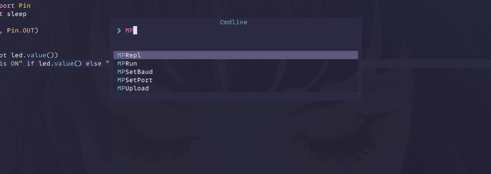
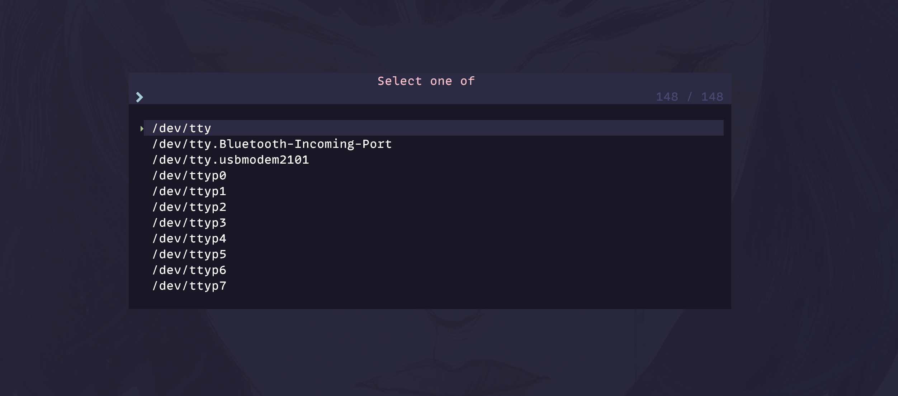
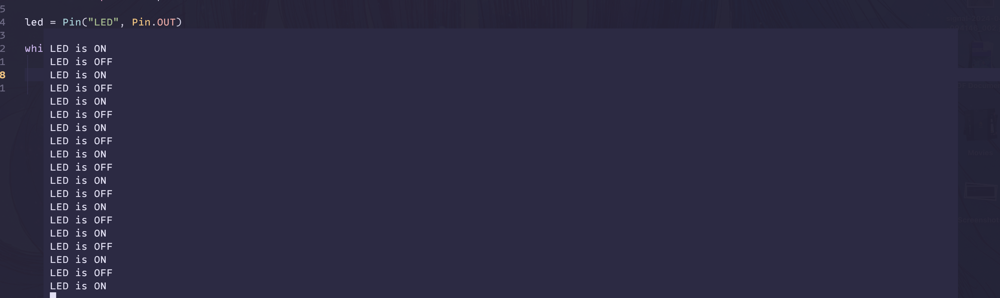
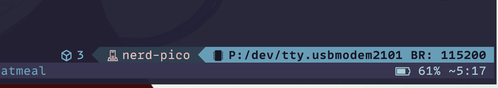

#  micropython_nvim

<!-- panvimdoc-ignore-start -->



Theme: [duskfox](https://github.com/EdenEast/nightfox.nvim)

<details>
<summary>Showcase</summary>





</details>

<!-- panvimdoc-ignore-end -->

## Introduction

micropython_nvim is a plugin that aims to make it easier and more enjoyable to work on MicroPython projects in Neovim. It uses [mpremote](https://docs.micropython.org/en/latest/reference/mpremote.html), the official MicroPython remote control tool.

See the [quickstart](#quickstart) section to get started.

N.B. If you open an existing project that has a `.micropython` configuration file in the root directory, the plugin will automatically configure the port for you.

Upgrading from v2? See [Migrating from v2](#migrating-from-v2).

**IMPORTANT** This plugin assumes you are opening Neovim at the root of the project. Some commands will not behave in the expected way if you choose not to do this.

## Goals

- Run and upload python files directly to your micro-controller from Neovim
- Easy multi-file project support with recursive directory upload
- Live development with filesystem mounting
- General file management on device
- Easy management of the device port and other settings
- Easy project environment setup
- Built-in REPL access

## Features

- **Run** local python files on your micro-controller
- **Upload** local python files to your micro-controller (including recursive directory upload)
- **Sync** mount local directory for live development without uploading
- **REPL** in a persistent split: send the current line, a selection or the whole buffer, and stop running code
- **File browser** - browse, edit, delete, download and create files and folders on the device
- **Device management** - list connected devices, reset, show device info and set its clock
- **Packages** - install micropython-lib and GitHub packages on the device with `mip`
- **Firmware** - install or update MicroPython on the board with [mpflash](https://github.com/Josverl/mpflash)
- **Project initialization** with type stubs matched to the connected board, set up for pyright

## Requirements

- [Neovim >= 0.9](https://github.com/neovim/neovim/releases/tag/v0.9.0)
- [mpremote](https://docs.micropython.org/en/latest/reference/mpremote.html)
- [uv](https://docs.astral.sh/uv/) (for dependency management, Unix-only)
- Optional: [snacks.nvim](https://github.com/folke/snacks.nvim) for nicer terminals and pickers. Without it the plugin uses Neovim's built-in terminal and `vim.ui.select`.
- Optional: [mpflash](https://github.com/Josverl/mpflash) for flashing firmware with `:MP flash`
  (`uv tool install mpflash`, or `pip install mpflash`)

Run `:checkhealth micropython_nvim` (or `:MP health`) to check your setup.

## Installation

### Prerequisites

Install uv (Unix/macOS):

```bash
curl -LsSf https://astral.sh/uv/install.sh | sh
```

Install mpremote (will be installed automatically by `uv sync`, or manually):

```bash
uv tool install mpremote
# or
pip install mpremote
```

### Plugin Installation

<details>
<summary>lazy.nvim</summary>

```lua
{
    "jim-at-jibba/micropython.nvim",
    dependencies = { "folke/snacks.nvim" }, -- optional
}
```

</details>

<details>
<summary>packer</summary>

```lua
use {
    "jim-at-jibba/micropython.nvim",
    requires = { "folke/snacks.nvim" }, -- optional
}
```

</details>

### Options

Options are optional; these are the defaults:

```lua
require("micropython_nvim").setup({
    port = "auto",          -- "auto", a port like "/dev/ttyUSB0", or "id:<serial>"
    debug = false,
    upload_on_save = false, -- upload project files to the device when you save them
    ui = {
        picker_layout = "select", -- snacks.nvim picker layout
    },
})
```

With lazy.nvim, call it from `config`:

```lua
{
    "jim-at-jibba/micropython.nvim",
    config = function()
        require("micropython_nvim").setup({ upload_on_save = true })
    end,
}
```

#### Upload on save

With `upload_on_save = true`, every file you write inside a MicroPython project (a folder with a
`.micropython` file) is uploaded to the same relative path on the device. Files and folders on the
[ignore list](#upload-ignore-list) are not uploaded (only the default list applies on save). Files
saved while an upload is running are queued and sent together when it finishes.

## Quickstart

1. [Install](#installation) micropython_nvim using your preferred package manager
2. Add a keybind to `run` function:

```lua
vim.keymap.set("n", "<leader>mr", require("micropython_nvim").run)
```

3. Follow the [project setup](#project-setup) steps to create the necessary files for a new project.

**Next steps**

- Add a [statusline component](#statusline)
- See the [examples](./examples/) directory for multi-file project examples

## Usage

All commands live under a single `:MP` command with tab completion: type `:MP <Tab>` to see them. Running `:MP` on its own opens a picker.

### Core Commands

| Command | Description |
|---------|-------------|
| `:MP run` | Run current buffer on the micro-controller |
| `:MP run_main` | Run the project's `main.py` on the device, without uploading it |
| `:MP upload` | Upload current buffer to the same project-relative path on the device |
| `:MP upload_all` | Upload all project files, keeping folders (unchanged files are skipped) |
| `:MP repl` | Open or focus the REPL split |
| `:[range]MP send` | Send the current line, or a range of lines, to the REPL |
| `:MP send_buffer` | Send the whole buffer to the REPL |
| `:MP interrupt` | Stop running code on the device (Ctrl-C in the REPL) |

### Development Commands

| Command | Description |
|---------|-------------|
| `:MP sync` | Mount local directory on device for live development |
| `:MP reset` | Soft reset the device |
| `:MP hard_reset` | Hard reset the device |
| `:MP info` | Show firmware, board, storage and clock; press `s` to set the device clock |
| `:MP mip <package> [target]` | Install a package on the device with mip |
| `:MP flash [version]` | Install or update MicroPython firmware with mpflash |

### File Management

| Command | Description |
|---------|-------------|
| `:MP files` | Browse, edit, delete and download files on the device |
| `:MP list_files` | List files on device |
| `:MP erase` | Delete single file or folder from device |
| `:MP erase_all` | Delete all files from device |

### Setup Commands

| Command | Description |
|---------|-------------|
| `:MP init` | Initialize MicroPython project (creates pyproject.toml, picks stubs for the connected board) |
| `:MP install` | Install project dependencies with uv, and the stubs into `typings/` |
| `:MP set_port` | Set the device port |
| `:MP set_stubs` | Switch the project's stubs (the connected board is suggested first) |
| `:MP list_devices` | List connected MicroPython devices |
| `:MP health` | Run `:checkhealth micropython_nvim` |

### Health Check

`:checkhealth micropython_nvim` reports on mpremote, uv, mpflash, snacks.nvim, the project config and whether a device is connected, with install hints for anything missing.

### Terminal Keymaps

Commands that open a terminal (`:MP run`, `:MP repl`, etc.) use the snacks.nvim terminal when it is installed, and a floating built-in Neovim terminal otherwise. The built-in terminal stays open if the command fails so you can read the error:

| Key | Mode | Action |
|-----|------|--------|
| `<Esc><Esc>` | Terminal | Exit to normal mode |
| `q` | Normal | Close terminal |

### Uploading

`:MP upload_all` copies the project to the device and keeps its folder layout: `web/templates/info.html`
is uploaded to `:web/templates/info.html`, and missing folders are created first. Files whose content
already matches the device are skipped, so uploading again only sends what changed.

`:MP upload` uploads the current buffer the same way: `lib/led.py` goes to `:lib/led.py`. A file
outside the project goes to the root of the device.

### REPL

`:MP repl` opens the REPL in a split at the bottom. It stays running when you go back to your code, and
`:MP repl` again focuses it instead of starting another. Press `<Esc><Esc>` to leave terminal mode and
`Ctrl-]` to quit mpremote.

Sending code opens the REPL if needed and keeps you in your buffer. A simple line is typed in as if
you entered it. Several lines, or a line like `for i in range(3): print(i)`, are sent in paste mode so
the REPL's auto-indent doesn't change them. Indentation they all share is removed, so you can send the
body of a function. Selections send whole lines. `:MP interrupt` skips anything still being sent.

While the REPL is open, `:MP run` runs the buffer in it: it stops whatever is running first (Ctrl-C),
waits a moment for the prompt, then pastes the buffer. Other commands that talk to the device need the serial port, so close the REPL
before using them.

Suggested keymaps:

```lua
local mp = require('micropython_nvim')
vim.keymap.set('n', '<leader>mr', mp.repl, { desc = 'MicroPython: REPL' })
vim.keymap.set('n', '<leader>ml', mp.repl_send_line, { desc = 'MicroPython: send line' })
vim.keymap.set('x', '<leader>ms', mp.repl_send_selection, { desc = 'MicroPython: send selection' })
vim.keymap.set('n', '<leader>mb', mp.repl_send_buffer, { desc = 'MicroPython: send buffer' })
vim.keymap.set('n', '<leader>mc', mp.repl_interrupt, { desc = 'MicroPython: stop running code' })
```

### File Browser

`:MP files` opens a browser showing the device filesystem as a tree, with file sizes and the free
space on the device. It loads in the background, so Neovim stays responsive while the device answers.

| Key | Action |
|-----|--------|
| `<CR>` | Open the file under the cursor in an `mp://<path>` buffer |
| `d` | Delete the file or folder under the cursor (asks first) |
| `D` | Download the file under the cursor into the project, at the same path |
| `a` | Create a folder in the folder under the cursor |
| `u` | Upload the file you opened the browser from into the folder under the cursor (save it first) |
| `R` | Refresh |
| `q` | Close |

An `mp://<path>` buffer holds a file from the device: edit it and `:w` writes it back. You can also
open one directly, for example `:e mp://lib/led.py`. Binary files can't be edited. If a file can't be read, its buffer
stays read-only, so `:w` can never replace a device file with an empty one. Actions that work on a folder use the folder
under the cursor, the folder of the file under the cursor, or the device root on the header lines.

### Device Info

`:MP info` shows the device's port, firmware version, board, storage used and free, and its clock. Press `s`
in the window to set the device clock to this computer's time (`mpremote rtc --set`), or `q` to close it.

### Installing Packages

`:MP mip <package>` installs a package onto the device with
[mip](https://docs.micropython.org/en/latest/reference/packages.html), in the background. The package is downloaded
by your computer, so the device doesn't need a network connection.

```vim
:MP mip aioble                    " from micropython-lib
:MP mip github:org/repo           " from GitHub (also gitlab:)
:MP mip github:org/repo@v1.2      " a branch or tag
:MP mip umqtt.simple lib/mqtt     " into a directory on the device
```

Without a target, mip installs into the device's `lib` folder (the first `.../lib` entry on its `sys.path`). `<Tab>`
completes common micropython-lib packages, and `:MP mip` with no package offers a picker of them.

### Flashing Firmware

`:MP flash` installs or updates MicroPython on the board with [mpflash](https://github.com/Josverl/mpflash). It
detects the connected board, then offers a picker of firmware versions: `stable` (the latest release, the default),
`preview` (the latest nightly build) and the most recent releases. mpflash downloads the firmware for that board and
flashes it in a terminal, so you can follow its progress and answer any question it asks.

```vim
:MP flash                         " detect the board, then pick a version
:MP flash stable                  " the latest release, no picker
:MP flash 1.24.1                  " a specific release
```

Only the board on the configured port is flashed (with port `auto`, the first USB serial device, as mpremote
picks it). The REPL is closed first, because mpflash needs the serial port. Flashing doesn't erase the files on the
device.

If the board is connected but doesn't run MicroPython yet (a new ESP32, say), mpflash asks which board it is. A
board that has no serial port at all, like a Pico held in BOOTSEL mode, can't be found through the port: flash it
from a shell with `mpflash flash --board RPI_PICO_W` (using your board's ID).

Supported ports, by how mpflash flashes them:

| Port | Method |
|------|--------|
| rp2 (Raspberry Pi Pico), samd, nrf | UF2: the board is put into its bootloader and the firmware copied to it |
| esp32, esp8266 | esptool, over the serial port |
| stm32 (pyboard) | DFU |

Other ports (mimxrt, renesas-ra and others) can be flashed by mpflash only over a debug probe, which `:MP flash`
does not set up.

mpflash is optional: install it with `uv tool install mpflash` (or `pip install mpflash`). Without it, `:MP flash`
says how to install it, and `:checkhealth micropython_nvim` lists it as optional. After updating the firmware,
`:MP set_stubs` picks stubs matching the new version.

### Upload Ignore List

`:MP upload_all` accepts file or folder names, or project paths, to ignore:
`:MP upload_all test.py docs web/static`

A name is ignored at any depth, so `__pycache__` skips every `__pycache__` folder. Default ignore list:

```lua
{
  '.git', 'pyproject.toml', 'uv.lock', '.ampy', '.micropython', '.vscode',
  '.gitignore', 'project.pymakr', 'env', 'venv', '.venv', '__pycache__',
  '.python-version', '.micropy/', 'micropy.json', '.idea',
  'README.md', 'LICENSE', 'requirements.txt'
}
```

## Project Setup

Steps to initialize a project:

1. Create a new directory for your project
2. Open Neovim in the project directory
3. Run `:MP init` - this will:
   - Detect the connected board and suggest its stubs (see Type Stubs below)
   - Create `pyproject.toml` with dependencies and stubs
   - Create `main.py` - starter blink program
   - Create `.micropython` - device configuration
   - Create `pyrightconfig.json` - LSP configuration that uses the stubs
   - Create `.gitignore`
   - Optionally run `uv sync` to install dependencies and the stubs

4. If you skipped the install prompt, run `:MP install` to install dependencies and the stubs
5. Run `:MP set_port` to set the port (or use `auto` for auto-detection)

### Type Stubs

Completion and diagnostics for `machine`, `network`, `rp2` and the rest come from the
[micropython-stubs](https://github.com/Josverl/micropython-stubs) packages.

With a device connected, `:MP init` and `:MP set_stubs` read the board and MicroPython version
from it and suggest matching stubs first: the board package (for example
`micropython-rp2-rpi_pico_w-stubs==1.24.1.*`), then the port package (`micropython-rp2-stubs`).
Suggestions are checked against PyPI. A version is pinned only when stubs exist for it, and a
board package is suggested only when one is published. Without a device, or to pick something
else, choose from the full list below the suggestions.

The chosen stubs are declared in `pyproject.toml` (or `requirements.txt`) and installed into
`typings/`. `pyrightconfig.json` sets `"stubPath": "typings"`. pyright looks there before its
own CPython standard library, so MicroPython's `time.sleep_ms` and friends resolve too.
`typings/` is git-ignored and excluded from checking.

`:MP set_stubs` updates an existing project the same way. It adds `stubPath` to an existing
`pyrightconfig.json`, and creates one unless `pyproject.toml` has a `[tool.pyright]` section.

Installing the stubs needs [uv](https://docs.astral.sh/uv/). Without it, run
`pip install --target typings <stubs>` yourself.

### Configuration File

The `.micropython` file stores project configuration:

```
PORT=auto
```

Port options:
- `auto` - Auto-detect first USB serial port
- `/dev/ttyUSB0` - Specific port path
- `id:<serial>` - Connect by USB serial number

### Multi-File Projects

For projects with multiple files and directories, see the [examples/led_button](./examples/led_button) directory.

Key features for multi-file projects:

- `:MP upload_all` uploads nested folders and skips unchanged files
- `upload_on_save = true` uploads each file as you save it
- `:MP sync` mounts local directory for live development
- `:MP run_main` runs your local main.py without uploading it

### Live Development with `:MP sync`

The `:MP sync` command mounts your local project directory on the device as `/remote`. This allows you to:

1. Edit files locally
2. Changes are immediately available on device (no upload needed)
3. Import modules from your local directory
4. Rapidly iterate without waiting for uploads

```
:MP sync        " Mount current directory
:MP repl        " Open REPL
>>> import main  " Run your code
```

## Statusline

A statusline component shows the current port configuration.

### Lualine Component

```lua
require("lualine").setup({
    sections = {
        lualine_b = {
            {
              require("micropython_nvim").statusline,
              cond = package.loaded["micropython_nvim"] and require("micropython_nvim").exists,
            },
        }
    }
})
```

<!-- panvimdoc-ignore-start -->

<!-- panvimdoc-ignore-end -->

## Migrating from v2

v3 removes the old commands and settings. Your keymaps that call Lua functions such as
`require("micropython_nvim").run` keep working.

### Commands

`:MP <subcommand>` replaces the `:MPxxx` commands, which no longer exist:

| v2 | v3 |
|----|----|
| `:MPRun` / `:MPRunMain` | `:MP run` / `:MP run_main` |
| `:MPUpload` / `:MPUploadAll` | `:MP upload` / `:MP upload_all` |
| `:MPRepl` / `:MPSync` | `:MP repl` / `:MP sync` |
| `:MPReset` / `:MPHardReset` | `:MP reset` / `:MP hard_reset` |
| `:MPListFiles` / `:MPListDevices` | `:MP list_files` / `:MP list_devices` |
| `:MPEraseOne` / `:MPEraseAll` | `:MP erase` / `:MP erase_all` |
| `:MPInit` / `:MPInstall` | `:MP init` / `:MP install` |
| `:MPSetPort` / `:MPSetStubs` | `:MP set_port` / `:MP set_stubs` |
| `:MPSetBaud` | Removed, see below |

### Baud rate

mpremote doesn't use a baud rate, so `:MPSetBaud`, `set_baud_rate()` and the `baud` option are
gone. Remove `baud` from your `setup()` call. A `BAUD=` line left in `.micropython` is ignored and
can be deleted. The statusline shows only the port.

### `.ampy` files

`.ampy` files are no longer read. Create a `.micropython` file with the port from `AMPY_PORT`, for
example `PORT=/dev/ttyACM0` (or `PORT=auto`), then delete `.ampy`.

### `:MP run_main`

`:MP run_main` now runs the `main.py` in your project, like `:MP run` on that file. v2 ran the copy
on the device. To run the device's `main.py`, use `:MP reset`: MicroPython runs `main.py` after a
soft reset.

### Removed Lua functions

- `initialise()`: use `setup()`
- `set_baud_rate()`
- The `.ampy` helpers in `micropython_nvim.utils` (`get_ampy_path`, `ampy_config_exists`,
  `read_ampy_config`, `ampy_install_check`) and `get_mpremote_base()`

## Examples

See the [examples](./examples/) directory for complete project examples:

- [led_button](./examples/led_button) - Multi-file project with LED and button modules

## Inspiration and Thanks

- [nvim-platformio.lua](https://github.com/anurag3301/nvim-platformio.lua)
